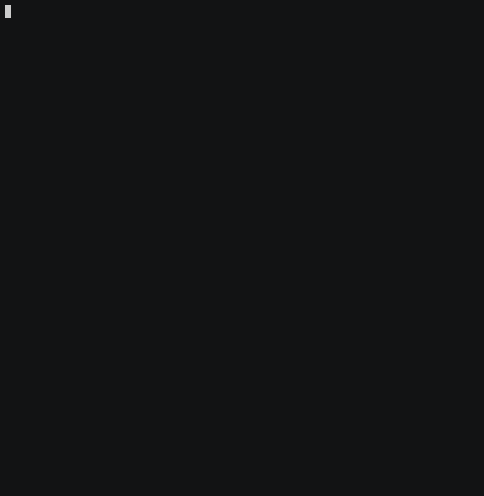

# Using health checks to monitor Spring Boot apps

This project shows how to use
[Spring Boot](https://spring.io/projects/spring-boot)
health checks to monitor an application deployed to
[Cloud Foundry](https://cloudfoundry.org) or Kubernetes.

A Spring Boot app using `spring-boot-starter-actuator` dependency
will get get an endpoint under `/actuator/health` for free,
which will return a `200 OK` HTTP page when the app is ready to serve
traffic:
```xml
<dependency>
    <groupId>org.springframework.boot</groupId>
    <artifactId>spring-boot-starter-actuator</artifactId>
</dependency>
```

When you add more Spring Boot aware dependencies (such as
[Spring Data JPA](https://spring.io/projects/spring-data-jpa)
or [Spring Data MongoDB](https://spring.io/projects/spring-data-mongodb)),
an [HealthIndicator](https://docs.spring.io/spring-boot/docs/current/api/org/springframework/boot/actuate/health/HealthIndicator.html)
implementation is automatically registered for you, checking
if this component is ready to be used.

In case you need to customize this resource with your own health check,
all you have to do is to register your own `HealthIndicator` implementation,
like this:
```java
@Configuration
@RequiredArgsConstructor
class AppConfig {
    private final AppStatus status;

    @Bean
    HealthIndicator healthIndicator() {
        return () -> status.isLive() ? Health.up().build() : Health.down().build();
    }
}

@Data
@Component
class AppStatus {
    private boolean live = true;
}
```

In this example, we use component
[Health](https://docs.spring.io/spring-boot/docs/current/api/org/springframework/boot/actuate/health/Health.html)
which is initialized from a custom value.

## How to use it?

You need a JDK 8+ to build this app:
```bash
$ ./mvnw clean package
```

Run this app with generated JAR file:
```bash
$ java -jar target/spring-healthcheck-demo.jar
```

This app is available at `http://localhost:8080`:
```bash
$ curl http://localhost:8080
Application status: UP
Hit http://localhost:8080/getdown to update application status, and see how the platform reacts to this update.%
```

If you hit `http://localhost:8080/actuator/health`, you can see the
Spring Boot healthcheck endpoint:
```bash
$ curl http://localhost:8080/actuator/health
{"status":"UP"}%
```

Now, if you go to `http://localhost:8080/getdown`, this endpoint will
set the custom healtcheck status to `DOWN`:
```bash
$ curl http://localhost:8080/getdown
Application status set to DOWN%
```

The Spring Boot healthcheck is now returning the updated status:
```bash
$ curl http://localhost:8080/actuator/health
{"status":"DOWN"}%
```

Since we do not run this app under a managed platform, this app will not restart.
Let's see what happens if you deploy this app to Cloud Foundry or Kubernetes.

## Deploy to Kubernetes


Deploy this app using the given Kubernetes descriptors:
```bash
$ kubectl apply -f k8s
namespace/spring-healthcheck-demo created
deployment.apps/app created
service/app-lb created
```

As you can see, this app is deployed under the namespace `spring-healthcheck-demo`:
```bash
$ kubectl -n spring-healthcheck-demo get pods
NAME                   READY   STATUS    RESTARTS   AGE
app-5668646795-6tkwv   0/1     Running   0          11s
```

This app is not marked as `READY` until the readiness probe under `/actuator/health`
returns a `200 OK` HTTP response:
```bash
$ kubectl -n spring-healthcheck-demo get pods
NAME                   READY   STATUS    RESTARTS   AGE
app-5668646795-6tkwv   1/1     Running   0          24s
```

Here are definitions for readiness probe and liveness probe:
```yaml
livenessProbe:
    # Liveness probe is used to check if this app is still ready to serve traffic
    # (after it is marked as "ready").
    httpGet:
        port: 8080
        path: /actuator/health
    initialDelaySeconds: 60
    periodSeconds: 2
    readinessProbe:
    # Readiness probe is used to check if this app is ready to serve traffic.
    httpGet:
        port: 8080
        path: /actuator/health
    initialDelaySeconds: 15
```

This app is exposed using a `LoadBalancer`:
```bash
$ kubectl -n spring-healthcheck-demo get svc
NAME     TYPE           CLUSTER-IP      EXTERNAL-IP      PORT(S)        AGE
app-lb   LoadBalancer   10.100.200.68   35.205.191.100   80:32151/TCP   3m24s
```

Hit the external IP (in this example: `35.205.191.100`) to access this app:
```bash
$ curl 35.205.191.100
Application status: UP
Hit http://35.205.191.100/getdown to update application status, and see how the platform reacts to this update.%
```

As soon as you hit `http://35.205.191.100/getdown`, the custom health check will be
updated, and the liveness probe will see the new value:
```bash
$ curl http://35.205.191.100/getdown
Application status set to DOWN%
```

This app is marked as not ready:
```bash
$ kubectl -n spring-healthcheck-demo get pods
NAME                   READY   STATUS    RESTARTS   AGE
app-5668646795-6tkwv   0/1     Running   1          5m18s
```

A few seconds later, the pod is restarted:
```bash
$ kubectl -n spring-healthcheck-demo get pods
NAME                   READY   STATUS    RESTARTS   AGE
app-5668646795-6tkwv   1/1     Running   1          6m11s
```

## Deploy to Cloud Foundry



Deploy this app to Cloud Foundry:
```bash
$ cf push
```

A random route is assigned to this app:
```bash
$ cf app spring-healthcheck-demo
Showing health and status for app spring-healthcheck-demo in org EMEA / space aroman as aroman@pivotal.io...

name:              spring-healthcheck-demo
requested state:   started
routes:            spring-healthcheck-demo-appreciative-numbat.cfapps.io
last uploaded:     Fri 26 Apr 17:00:34 CEST 2019
stack:             cflinuxfs3
buildpacks:        client-certificate-mapper=1.8.0_RELEASE
                   container-security-provider=1.16.0_RELEASE
                   java-buildpack=v4.19-offline-https://github.com/cloudfoundry/java-buildpack.git#3f4eee2
                   java-main java-opts java-security
                   jvmkill-agent=1.16.0_RELEASE open-jdk-...

type:           web
instances:      1/1
memory usage:   1024M
     state     since                  cpu    memory         disk           details
#0   running   2019-04-26T15:27:02Z   0.4%   163.7M of 1G   129.2M of 1G
```

Hit this random route to access this app:
```bash
$ curl http://spring-healthcheck-demo-appreciative-numbat.cfapps.io
Application status: UP
Hit http://spring-healthcheck-demo-appreciative-numbat.cfapps.io/getdown to update application status, and see how the platform reacts to this update.%
```

Health checks are defined in the app manifest:
```yaml
---
applications:
  - name: spring-healthcheck-demo
    path: target/spring-healthcheck-demo.jar
    random-route: true
    # You need to set these entries to tell Cloud Foundry how to monitor this app:
    # Spring Boot automatically exposes an HTTP endpoint for you.
    health-check-type: http
    health-check-http-endpoint: /actuator/health
```

That's all you need to set your app health check endpoint.
As soon as you update the health check status, this app is
automatically restarted by Cloud Foundry.

## Contribute

Contributions are always welcome!

Feel free to open issues & send PR.

## License

Copyright &copy; 2019 [Pivotal Software, Inc](https://pivotal.io).

This project is licensed under the [Apache Software License version 2.0](https://www.apache.org/licenses/LICENSE-2.0).
